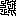
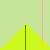

# Wave Function Collapse

[TOC]


## Introduction

L'algorithme Wave Function Collapse (ou WFC) est un algorithme de pavage de plan sous contraintes. Il a été inventé en 2016 par Maxim Gumin. 
Etant donné un ensemble de carreaux de forme carrés et de règles d'adjacence (qui indiquent quels carreaux peuvent se situer à côté de quels autres carreaux), l'algorithme pave un région carrée de l'espace.
Les principales applications de l'algorithme sont dans le domaine de la génération de textures procédurales, de niveaux de jeux vidéos, voire même la génération de texte. Les principes de l'algorithmes peuvent être généralisés pour résoudre d'autres problèmes de satisfactions de contraintes, comme pour des problèmes de coloriages de graphes (Karth & Smith, 2017; Mac & Perkins, s. d.).

Par exemple, étant donnée l'entrée suivante:



L'algorithme pourra générer une image plus grand telle que celle ci-dessous.


## Historique

Les origines de WFC remontent à une thèse de Paul C. Merrell écrite en 2009. Celle-ci décrit des techniques de générations procédurales de objets 3d autosimilaires utilisant des exemples de petite taille pour générer des objets plus gros qui sont localement similaires aux exemples.

Pour être plus précis, le problème consiste à remplir une grille 3d avec des étiquettes de manière à ce que 2 étiquettes soit adjacente dans la grille à remplir si et seulement si il existe un endroit dans la grille d'entrée où ces étiquettes sont adjacentes.

Dans le cas 2d, cela consiste à utiliser des dominos avec des contraintes de d'adjacences pour générer une image plus grosse en suivant. De tels dominos s'appellent des dominos de Wang et sont utilisés pour produire des images de complexité variée (Cohen et al., 2003).

Pour résoudre ce problème, il est possible de mettre dans chaque case de la grille une liste des étiquettes pouvant aller à cet emplacement, puis si des étiquettes sont connus, de propager à travers la grille la liste des étiquettes possibles à chaque emplacement en utilisant les contraintes. Si aucune propagation de contrainte n'est possible, on peut sélectionner au hasard une case dont on choisit au hasard l'étiquette parmi les valeurs possibles.

Cette propagation des contraintes à travers la grille permet de générer des objets avec des propriétés non-locales.

La principale nouveauté apportée par WFC est l'utilisation de entropie comme métrique pour sélectionner la prochaine case à étudier, c'est à dire de considérer en premier les cases pouvant prendre le moins d'étiquettes possibles en premier.

## Description formelle du problème

Notons $E$ la texture d'entrée de l'algorithme. C'est une matrice à coefficients entiers qui représente une image (et chaque coefficient correspond à une étiquette comme une couleur par exemple), de dimension $(n'_x,n'_y) \in {\mathbb{N}^*}^2$. On souhaite produire une matrice $M$ localement similaire à $E$ de taille $(n_x,n_y) \in {\mathbb{N}^*}^2$.

On note $K$ l'ensemble de coefficients de $E$. On se ramène au cas où $K = [\![0,k-1]\!]$ où $k \geq 1$ est le nombre d'éléments dans $K$. 

On dit que $a$ est un point de $M$ ou que $a$ est dans $M$ si $a = (a_x,a_y)$ avec $0 \leq a_x,a_y \text{ et } a_x < n_x, a_y < n_y$ . On note alors $M_a \in K$ la valeur de $M$ au point $a$.

On définit l'ensemble des directions $D$ par $\{(0,1),(0,-1),(1,0),(-1,0)\}$

On dit que $M$ est consistant avec $E$ si pour tout point $(a_x,a_y)$ dans $M$, et tout vecteur $(d_x,d_y) \in D$ tel que $(a_x+d_x,a_y+d_y)$ soit aussi dans M, il existe un point $(b_x,b_y)$ dans $E$ tel que:

$$M_{a_x,a_y} = E_{b_x,b_y}$$ et $$M_{a_x+d_x,a_y+d_y} = E_{b_x+d_x,b_y+d_y}$$

L'objectif de l'algorithme WFC est de produire une matrice $M$ consistante avec une matrice $E$.

## Propriétés du problème

On définit la matrice de transition $T_{(d_x,d_y)}[n,m]$ avec $0 \leq n,m < k$ et $(d_x,d_y) \in D$ comme étant la matrice à coefficients dans $\{0,1\}$ tel que:

$T_{d}[n,m] = 1 \iff \exists a, E_a = n \and E_{a+d}=m $

De manière informelle, la matrice $T$ contient l'ensemble des transitions valides et permet d'accélérer les calculs en n'ayant pas à explorer l'intégralité de $E$ pour déterminer si une paire de carreaux peut être adjacente.

En effet, $M$ est consistant avec $E$, si et seulement si pour tout point $a$ de $M$ et $d \in D$ tel que $a+d$ est dans $M$, on a:

 $T_d[M_x,M_{x+d}] = 1$

En général, le nombre de solutions est borné par $k^{n_xn_y}$ . Cette borne est atteinte lorsque $E$ contient tous les arrangements possibles de paires de coefficients.

Le nombre de solution peut être nul, c'est en particulier le cas si $E = \begin{pmatrix}1&2\\3 &4\end{pmatrix}$ et $n_x > 2$. En effet, lorsqu'un 1 (resp. un 3) est placé, un 2 (resp. un 4) doit être à sa droite et lorsqu'un 2 est placé, rien ne peux être à sa droite, ce qui bloque la pavage.

Le nombre de solutions peut être 1, c'est un particulier le cas si $E = \begin{pmatrix} 0&0\\0&0\end{pmatrix}$

Le nombre de solutions peut également être 2, c'est le cas si $E = \begin{pmatrix}1&0\\0&1\end{pmatrix}$, ce qui donne comme pavage un échiquier et où le point $(0,0)$ détermine totalement la solution.

Plus généralement, si on souhaite que le problème ait $n$ solutions, il suffit de construire $E$ de taille $n \times n$ de la forme $E = \begin{pmatrix}0&1&...&n\\1&2&...&0\\...&&&...\\n&0&...&n-1\end{pmatrix}$

### NP-complétude du problème

On analyse la complexité du point de vue de la taille de la matrice de sortie $M$ que l'on suppose strictement plus grande dans les deux dimensions par rapport à $E$

Ce problème est NP (Merrell, 2009), en effet, si on dispose d'une matrice $M$, il suffit de construire les 4 matrices de transitions $T_d$ associées aux 4 directions en temps $O(n'_x n'_y + k^2)$  (on a $k \leq n'_x \times n'_y$ avec égalité lorsque tous les coefficients de $E$ sont distincts).

Alors, on peut vérifier que $M$ est consistant avec $E$ en $O(n_x n_y)$, ce qui est bien polynomial en les dimensions de l'image.

Pour montrer que le problème est NP-difficile, on considère un problème 3-SAT planaire.

C'est un problème qui consiste à satisfaire une formule booléenne composée d'une conjonction de clause contenant des disjonctions de variables et qui peut être représenté sous la forme d'un graphe planaire biparti où chaque variable et chaque clause est un sommet et chaque arrête indique qu'une variable se trouve dans une clause.

Alors, il est possible de représenter ce problème par une matrice $E$ dont les composants vont représenter le graphe planaire.

On choisit un coefficient pour représenter la valeur VRAI et un qui représente la valeur FAUX. Un VRAI peut être entouré de VRAI et un FAUX peut être entouré de FAUX mais un VRAI et un FAUX ne peuvent jamais se toucher.

On utilise des coefficients qui vont servir à construire des "câbles" pour propager les valeurs logiques. Les variables et les liens logiques vont être constitué par des boîtes et des câbles constitués de ces câbles.

On utilise un coefficient spécial qui doit être placé dans un câble sur le mur de droite. A gauche de ce coefficient peuvent se trouver 2 coefficients (noté A et B) (qui font correspondre au passage de VRAI vers FAUX et au passage de FAUX vers VRAI). Pour A, seul un VRAI peut être au dessus de lui et seul un FAUX peut être sous lui. Pour B, seul un FAUX peut être au dessus de lui et seul un VRAI peut être sous lui.

On utilise une technique similaire pour grouper les paires de 3 clauses. On utilise un coefficient qui est placé au niveau d'une intersection dans un câble. A gauche de ce coefficient peuvent se trouver 3 coefficients (noté C,D et E). C requière un VRAI au dessus de lui. D requière un VRAI sous lui. E requière un VRAI à sa gauche.

Pour forcer $M$ à avoir l'apparence du graphe en terme de connexion, on peut créer des coefficients placés en bas de M pour lequel il n'existe pas de coefficients plaçables en dessous. A partir de ces coefficients, on peut créer des coefficients qui doivent être placer au dessus de cette première ligne et ainsi de suite. On force alors $M$ à avoir les murs délimitant les câbles représentant les arêtes du graphe planaire aux bons emplacements. On fixe également la taille de $M$ de manière à ce que $M$ puisse représenter le graphe voulu.

Cette technique montre que résoudre le problème de contraintes associé à un ensemble de matrice de transition $T$ donné est bien NP-difficile.

De plus, étant donné une matrice de transition $T$, on peut construire une matrice $E$ qui engendre  $T$ en ajoutant des coefficients qui apparaitrons une seule fois de manière à délimiter les coefficients "utiles".

Ainsi, on a montré qu'il existe une solution à l'instance du problème 3-SAT planaire si il existe une matrice $M$ de la taille spécifié consistante avec la matrice $E$ décrite.

Le problème est donc bien NP-complet.

### Version indécidable

Si on généralise le problème à la question: étant donné une matrice $E$ est-t-il possible pour tout $n_x,n_y \in \mathbb{N}$ de trouver une matrice $M$ de taille $(n_x,n_y)$ tel que $M$ est consistante avec $E$, le problème devient indécidable.

En effet, ce problème revient à se demander si étant donné un ensemble de carreaux et des contraintes d'adjacences entre les carreaux, il est possible de paver le plan. C'est une version plus forte du problème des dominos de Wang. En effet, dans le problème des dominos de Wang, si A peut être à gauche de B, B peut être à droite de C et C peut être à gauche de D, alors A doit nécessairement être plaçable à gauche de D. Ce n'est pas nécessaire ici.

Ce problème est indécidable (Berger, 1966) car il est possible de simuler une machine de Turing en utilisant l'une des dimensions de plan pour représenter le temps et l'autre dimension pour représenter la bande de la machine.

Ces deux résultats montrent le besoin d'approches heuristiques pour résoudre efficacement le problème de trouver des matrices consistantes à une matrice donnée.

## Description de l'algorithme WFC

Bien que le nom de l'algorithme évoque la physique quantique, le fonctionnement concret n'a aucune relation avec les fonctions d'ondes au sens quantique.

On souhaite produire un tableau de taille $n_x \times n_y$.

L'idée consiste à initialiser un tableau $C$ de taille $n_x \times n_y \times k$ à valeurs booléennes à $\text{VRAI}$. Ce tableau représente les étiquettes possibles de l'image, ce que l'auteur appelle la fonction d'onde car ce tableau contient d'une certaine manière une superposition des états de l'image.

On choisit progressivement  des positions de $C$ que l'on met à $\text{FAUX}$ en choisissant celle qui possèdent le moins de valeurs $\text{VRAI}$. Ces positions sont celles avec l'entropie la plus faible, c'est à dire où l'incertitude est minimale (mais non nulle), car il reste peu d'étiquettes valides. Cela permet de se concentrer en priorité sur les cases avec un nombre importants de contraintes déjà connus pour éviter les contradictions. On peut faire l'analogie avec la méthode manuelle pour résoudre un sudoku: on se concentre sur les cases où il reste peu de possibilités de chiffres différents en priorité.

Lorsque l'on modifie $C$ en choisissant une étiquette à une position donnée, on met à jour récursivement ses voisins jusqu'à ce qu'aucune mise à jour soit possible.

On garde les notations introduites dans la section précédente. L'algorithme consiste alors à effectuer les tâches suivantes :


Entrée: une matrice E, $n_x$ et $n_y$ deux entiers strictement positifs
1. On calcule $k = 1 + \max_{i,j} E_{i,j}$

2. On crée les 4 matrices de transitions $T_d$ en itérant sur tous les coefficients de $E$.

3. On crée $C$ un tableau de taille $n_x \times n_y \times k$ à valeurs booléennes que l'on initialise à VRAI

4. Répéter les étapes:

   1. Trouver le couple $(p_x,p_y)$ tel que le tableau $C_{p_x,p_y}$ possède moins de coefficients $\text{VRAI}$ possibles, mais au moins 2 coefficients $\text{VRAI}$, si plusieurs tels couple existe, en prendre un au hasard. Si aucun tel couple existe, quitter cette boucle.

   2. Choisir un indice $i$ dans $C_{p_x,p_y}$ tel que $C_{p_x,p_y,i}$ est $\text{VRAI}$ et mettre à $\text{FAUX}$ tous les autres éléments de $C_{p_x,p_y}$.

   3. Initialiser un tas $s$ et mettre $u = (p_x,p_y)$ dedans.

   4. Tant que $s$ n'est pas vide:

      1. Extraire un élément $q$ de $s$

      2. Pour chaque direction $d$ dans $D$ et chaque $i \in K$:

         Si $C_{q+d,i} = \text{VRAI}$ et $\nexists b \in [\![0,k-1]\!]$ tel que ($C_{q,b} = \text{VRAI}$ et $T_d[b,i] = \text{VRAI}$) alors assigner $C_{q+d,i}$ à $\text{FAUX}$ et ajouter $q+d$ à $s$ si cela n'a pas été fait pour une valeur de $i$ précédente.

   5. Aller à l'étape 1

5. On crée une matrice $M$ de taille $n_x \times n_y$. On parcourt $C$ de manière à trouver pour chaque couple $(p_x,p_y)$ l'indice $i \in [\![0,k-1]\!]$ tel que $C_{p_x,p_y,i}$ est vrai. On assigne alors à $M_{p_x,p_y}$ la valeur $i$. Si aucun indice existe pour l'un des couples, l'algorithme échoue.

On appelle cet algorithme "WFC classique"

Bien que cet algorithme produise une matrice $M$ consistante avec $E$, on peut en plus exiger que la distribution des étiquettes dans $E$ soit similaire à celle dans $M$. Pour cela, on peut stocker en plus un tableau qui stocke le ratio de différentes étiquettes dans $E$ dans un tableau $p_i$.

On a alors bien sûr
$$
\sum_{i=0}^{k-1}p_i = 1
$$
Dans ce cas, dans l'étape 4a, au lieu de choisir un indice $i$ de manière uniforme, on peut le choisir en respectant la distribution des étiquettes dans $E$.

Dans ce cas, pour le calcul d'entropie, on peut utiliser la formule classique (en assimilant $\text{VRAI}$ à $1$ et $\text{FAUX}$ à $0$)
$$
S = \sum_{i=0}^{k-1}p_i \log(p_i) C_{p_x,p_y,i}
$$
Cela permet de réduire les cas d'égalité lors de la sélection de couple sans augmenter diminuer la performance car $p_i \log(p_i)$ peut être précalculé et stocké dans une table.

On appelle cette variation de l'algorithme "WFC uniforme"

## Complexité

Dans l'algorithme "WFC classique", la boucle 4 est exécutée $n_x \times n_y$ fois dans le pire des cas.

L'étape 4.a demande $n_x \times n_y$ étapes pour trouver la case d'entropie minimale.

La boucle 4.d.ii est exécutée dans le pire des cas pour chaque point de $M$, et pour chaque éléments de $K^2$, en effet à chaque passage où une déduction est possible, vérifier l'inexistance de $b$ demande $k$ étapes. Cette vérification n'est pas exécutée plus de fois que la taille de $C$ car $C_{d+q,i}$ doit être faux à cette étape pour que cette vérification soit exécutée. C'est donc bien un pire des cas. 

La boucle principale à donc pour complexité $O((k^2 + n_xn_y)n_xn_y)$

L'initialisation de $C$ se fait en  $O(kn_xn_y)$

La construction de $T$ se fait en $O(k^2 + n'_xn'_y)$.

La complexité totale est donc $O(n_x^2n_y^2)$ en supposant que la matrice à produire est plus grande que la matrice d'entrée. 

## Optimisations

L'algorithme "WFC" classique est limité par plusieurs facteurs. Tout d'abord, la recherche de la case avec l'entropie la plus faible est chronophage. De plus, stocker un tableau de dimension $k\times n_x \times n_y$ demande beaucoup de mémoire. Cela peut poser beaucoup de problème lorsque $k$ est grand, ce qui arrive souvent en pratique, comme on le verra dans la section suivante sur les variantes de WFC.

Pour résoudre ces problèmes, on utilise des dictionnaires (sous la forme de table de hashage) et des ensembles à la place des tableaux.

On représente $C$ par un dictionnaire de $\mathbb{N}^2$ vers un ensemble d'étiquettes (qui sont des entiers).

On représente $T$ par un dictionnaire de $D \times K$ vers un ensemble à valeurs dans $K$. On note $T_d[i,...]$ l'ensemble associé à la paire $(d,i) \in D \times K$. On a: $j \in T_d[i,...] \iff T_d[i,j]$

Remarquons aussi que $T_d[i,j] \iff T_{-d}[j,i]$.

Si une position dans la matrice peut contenir n'importe quelle étiquette, on ne met pas cette position dans le dictionnaire $C$, celui-ci est donc initialement vide.

Lorsqu'un ensemble dans $C$ contient seule 1 étiquette, on la supprime de $C$ et on la met dans le tableau représentant l'image finale, ce qui indique que l'on n'a plus à considérer la position associée à cet ensemble.

Ainsi, lors du calcul de l'entropie, uniquement les positions $(p_x,p_y)$ non triviales sont considérées.

De plus, grâce aux ensembles, l'opération 4.d.ii peut être décrite sous la forme d'union et l'intersection d'ensembles:

2. Pour chaque direction $d$ dans $D$ et chaque $i \in K$:

   ​	Si $i \in C_{q+d}$ et $C_q \cap T_{-d}[i, ...] = \varnothing$, alors, retirer $i$ de $C_{q+d}$ et ajouter $q+d$ à $s$ si cela n'a pas été fait pour une valeur de $i$ précédente.

Pour représenter les ensembles $C_{q+d}$ et $T_d[i,...]$, on peut utiliser un filtre de Bloom. C'est une structure de donnée qui permet de calculer des cardinaux d'union et d'intersections en temps constant (Cohen et al., 2003), ce qui rend la vérification très rapide. Il peut donner lieu à des faux positifs concernant l'appartenance d'un élément à un ensemble.

Puisque l'on sait que leur cardinal est borné par $k$, il est possible de choisir la taille des filtres de manière à ce que les faux positifs soit suffisamment rares pour cela ne pose pas de problème en pratique et que la probabilité de faux positifs soit négligeable devant la probabilité que l'algorithme échoue.

Puisque l'on ne peut qu'ajouter des éléments dans un filtre de Bloom, on doit passer au complémentaire sur $C_q$ et $T_d[i,...]$. On note ces complémentaires $T^c_d[i,...]$ et $C^c_q$. 

$T^c_d[i,...]$ stocke alors les étiquettes qui ne peuvent pas être adjacente à $i$ dans la direction $d$

$C^c_q$ stocke les étiquettes qui ne peuvent pas se trouver à l'emplacement $q$. 

On doit stocker simultanément $C^c$ et $C$ de manière à pouvoir effectuer le calcul d'entropie efficacement, cependant, ce n'est pas trop problématique car les modifications de $C$ (le retrait d'éléments d'un ensemble) sont effectuées en temps constant et car $C$ ne stocke que les cases en construction (le cardinal de $C_q$ est compris entre $2$ et $k-1$), ce qui réduit sa taille en  mémoire.

La formule précédente devient alors:

2. Pour chaque direction $d \in D$ et chaque $i \in C_{d+q}$:

   Si $|C^{c}_q \cup T^{c}_{-d}[i, ...]| = k$, retirer $i$ de $C_{q+d}$ , ajouter $i$ à  $C^{c}_{q+d}$ et ajouter $q+d$ à $s$ si cela n'a pas été fait pour une valeur de $i$ précédente.

On teste si le cardinal de l'union vaut bien $k$, ce qui garanti son égalité à $K$ et permet bien d'avoir une opération en temps constant.

La boucle demande alors $O(k n_xn_y)$ étapes au plus alors car il faut supprimer $(k-1)n_xn_y$ possibilités de $C$ au plus pour avoir une image finie avec cette boucle

La boucle principale à donc pour complexité $O((k + n_xn_y)n_xn_y)$. La complexité dans le pire des cas ne change donc pas car la recherche de l'élément avec l'entropie minimale reste la partie de l'algorithme qui prend le plus de temps. Ce cas arrive rarement en pratique car il suppose qu'aucune déduction ne peux être effectuée après chaque choix de valeurs à l'étape 4.1. 

La complexité en pratique est donc plutôt  $O((k + \log(n_xn_y))n_x n_y)$, lorsque les contraintes sont assez fortes pour qu'un nombre logarithmique de choix arbitraires soit effectués.

On peut encore diminuer la complexité en utilisant une structure de donnée avec une extraction rapide de minimum et une modification rapide des éléments. 

C'est possible avec une liste à saut qui donne une extraction du minimum en temps constant et une modification d'éléments en temps $\log(n_xn_y)$ (Pugh, 1990). On stocke dedans les coordonnées et l'entropie associé à ces coordonnées. Cela donne alors une complexité dans le moyenne de $O(k \log(n_xn_x)n_xn_y)$ car il faut modifier la liste dans la boucle 4.d.ii, mais rend le calcul de l'entropie négligeable du point de vue de la complexité car ce calcul coûterait $O(log(n_xn_y)n_xn_y)$ opérations au total. Cela n'améliore cependant pas le pire de cas car la complexité de la modification d'une liste à saut dans le pire des cas est $O(n_xn_y)$.

Si on veut que la complexité dans le pire des cas soit aussi de $O(k\log(n_xn_y)n_xn_y)$, il est possible d'utiliser une file de Van Emde Boas qui possède une extraction de minimum et une modification d'éléments en temps $\log(n_xn_y)$ dans le pire des cas (Boas, 1977). Cette structure de donnée demande néanmoins beaucoup de mémoire, cette optimisation n'a donc qu'un intérêt théorique.

La complexité avec ces optimisations est donc $O(k \log(n_xn_y)n_xn_y)$ en moyenne.

## Gestion des contradictions

L'algorithme précédent peut ne pas réussir à obtenir une matrice convenable. En effet, il est possible que $\exists p_x,p_y, \forall i, C_{{p_x},{p_y},i} = \text{FAUX}$. On appelle cette situation une contradiction.

 Lorsqu'une contradiction est atteinte, on ne peut plus espérer pouvoir produire une matrice consistante puisqu'aucun coefficient pourra être placé à l'emplacement de la contradiction de manière à satisfaire les contraintes.

Plusieurs techniques permettent de résoudre les contradictions. La première consiste à abandonner et recommencer l'algorithme depuis le départ jusqu'à générer une matrice convenable. Cette méthode n'est pas très efficace, surtout lorsque les matrices considérés sont grandes, ce qui augmente le risque d'obtenir une contradiction lors du processus de génération.

Une autre technique consiste à revenir en arrière: On revient à l'étape 4a et on choisit une autre paire $(p_x,p_y)$ ou un autre $i$ dans $C_{p_x,p_y}$ et on reprend le processus à partir de là.

L'inconvénient est alors que l'on doit stocker une copie de la matrice $C$ à l'étape 4a, ou au moins une liste des cases modifiées par la boucle 4d de manière à restaurer $C$ à l'état initial, ce qui peut augmenter la consommation de mémoire.

Un inconvénient plus important est qu'alors, l'algorithme ne va plus nécessairement s'arrêter. Il est en effet possible que quelque soit le choix de $(p_x,p_y)$, une matrice convenable ne soit pas obtenable. L'algorithme va alors constamment faire un essai de coefficient, remarquer une contradiction, revenir en arrière et réessayer.

Pour résoudre ce problème, on peut mettre en place un système de retour en arrière avec un tas qui va stocker des copies de $C$ à différentes étapes du processus de génération. Si après un nombre donné de retours en arrière une contradiction est atteinte, on peut retourner alors en arrière une seconde fois et repartir de ce point. Si on retourne en arrière à ce point trop de fois, on retourne en arrière une fois de plus, de manière à revenir sur ses pas autant que nécessaire pour produire une image convenable.

Cette approche consomme beaucoup plus de mémoire et demande de stocker une liste des modifications effectués à $C$ pour revenir en arrière. Cette approche est similaire à une exploration exhaustive des possibilités et rend l'algorithme alors comparable à l'algorithme non-heuristique qui consiste à effectuer une recherche par force brute. La complexité dans le pire des cas est alors exponentielle.

## Variantes

### Contraintes avec un voisinage plus grand

L'algorithme "WFC" classique décrit ne permet d'imposer des contraintes que sur les 4 voisins d'une case donnés. On peut désirer avoir accès à des contraintes plus fortes, par exemple en imposant des contraintes sur les 8 voisins d'une case (en incluant les diagonales). La méthode la plus simple pour cela serait de modifier l'ensemble $D$.

Cependant, ce n'est pas nécessaire. Il est en effet possible de renuméroter les coefficients de $E$ de manière à obtenir des règles plus fortes. Pour chaque élément de $E$, on regarde ses 8 voisins et lui-même. Si ce groupe d'éléments n'a pas encore été rencontré, on crée un nouveau coefficient pour représenter ce voisinage. On peut utiliser un dictionnaire qui associe un voisinage (soit un 9-uplet) à un coefficient pour effectuer cela efficacement.

On peut alors renuméroter E avec les coefficients du dictionnaire. Le nouveau nombre de coefficients noté $k'$ est alors borné par $min(n'_xn'_y,k^9)$. La complexité de cette étape de prétraitement est $O(n'_xn'_y)$ car il suffit de parcourir $E$ une seule fois pour construire la table de renumérotation des coefficients.

On voit que dans le pire des cas, $k$ peut grandement augmenter, cependant, si le motif de $E$ est assez régulier initialement, ce n'est pas le cas et l'algorithme reste utilisable en pratique.

Cette technique permet d'encoder des contraintes qui ne serait pas directement exprimable avec l'algorithme original. Par exemple, si un coefficient 0 peut se trouver à droite ou à gauche d'un coefficient 1 mais un 1 ne peux jamais se trouver simultanément entre deux 0, cette technique permettra d'encoder cette propriété en donnant 2 numéros différents aux 1 avec un 0 à leur gauche et les 1 avec un 0 à leur droite.

### Contraintes prédéfinies par l'utilisateur

Dans le contexte de génération procédurale, on peux vouloir imposer des contraintes sur des positions spécifiques de la matrice $M$. C'est par exemple le cas si on veut imposer qu'un niveau ait nécessairement une entrée et une sortie ou qu'une texture ait au moins un pixel d'une couleur donnée.

Pour cela, il suffit d'initialiser $C$ de manière à imposer les contraintes aux endroits voulus et effectuer une étape de propagation autour des valeurs avec des contraintes. Cela accélère aussi la vitesse de l'algorithme car il y a moins d'étapes de choix de positions nécessaires.

Par exemple, pour forcer un coefficient 0 à la position (1,1), on assigne à FAUX tout les coefficients $C_{1,1}$ à l'exception de $C_{1,1,0}$ qui reste VRAI. On applique ensuite les étapes 4.c et la boucle 4.d de l'algorithme en initialisant le tas avec la position $(1,1)$.

### Autres formes de grilles

L'algorithme WFC classique fonctionne sur un graphe grille sur lequel on effectue un parcours en profondeur dans la boucle 4.d.ii. En modifiant cette boucle, il est cependant possible d'adapter l'algorithme WFC à n'importe quel graphe à condition de pouvoir fournir un matrice de transition pour chaque paire de sommets.

Voici trois exemples de graphes particuliers sur lequel on peut appliquer WFC:

- Une grille 3d en utilisant des triplets pour stocker les coordonnées plutôt que des paires.

- Une grille avec des cases hexagonales en considérant 6 cases adjacentes pour $D$ plutôt que 4: $D = \{(1,0), (-1,0), (0,1), (0,-1), (1,1),(1,-1)\}$ pour les cases sur les lignes de numéros pairs et  $D = \{(1,0), (-1,0), (0,1), (0,-1), (-1,1),(-1,-1)\}$ pour les cases sur les lignes de numéros impairs.

- Un grille hyperbolique où chaque case est de forme carré et cinq carrés se rencontrent à chaque sommet. (contre 4 sur une grille normale) en utilisant un système de coordonnées adapté au plan hyperbolique. (dans ce cas, chaque case possède toujours 4 voisins)

En utilisant un graphe chemin, il est également possible d'utiliser WFC pour produire du texte procéduralement. Pour cela, on prend un paragraphe de texte et on assigne chaque mot à un coefficient. Ensuite, on produit un ensemble de règles pour déterminer quels mots peuvent précéder et suivre quels autres mots. Enfin, on applique l'algorithme WFC pour résoudre les contraintes associés à cet ensemble de règles pour produire un texte plus ou moins cohérent (car chaque mot ne dépend que de ses voisins immédiats).

Par exemple, en prenant comme texte d'entrée la fable de La Fontaine "Le Corbeau et Le Renard", l'algorithme produit en sortie (avec un prétraitement pour retirer la ponctuation et les majuscules):

```
sa belle voix il ouvre un fromage sans mentir si votre plumage vous me semblez beau que vous êtes le renard par l'odeur alléché lui tint à peu tard
```

Sur un graphe abstrait quelconque, l'algorithme WFC donne une approche pour résoudre le problème de coloriage de graphe. On choisit aléatoirement une couleur pour le sommet avec le moins de couleurs possibles à choisir (c'est à dire celui avec l'entropie la plus faible non nulle) et on propage les contraintes de couleurs autant que possible. 

## Exemples concrets

Considérons l'image de départ suivante :


L'objectif est de produire une image plus grande localement similaire à celle-ci.

Tout d'abord, on assigne chaque couleur à un nombre. Ici, vert vaut 2, jaune vaut 1 et bleu vaut 0.

La matrice $E$ est alors:

$$
\begin{pmatrix}
0 & 0 & 0 & 0 & 0 & 0 & 0 & 0 & 0 & 0 & 0 & 0 & 0 & 0 & 0 \\
0 & 0 & 0 & 0 & 0 & 0 & 0 & 0 & 0 & 0 & 0 & 0 & 0 & 0 & 0 \\
0 & 0 & 0 & 0 & 0 & 0 & 0 & 0 & 0 & 0 & 0 & 0 & 0 & 0 & 0 \\
0 & 1 & 1 & 0 & 0 & 0 & 0 & 0 & 0 & 0 & 0 & 1 & 1 & 1 & 0 \\
1 & 1 & 1 & 1 & 1 & 0 & 0 & 0 & 0 & 1 & 1 & 1 & 1 & 1 & 1 \\
1 & 1 & 1 & 1 & 1 & 1 & 0 & 0 & 1 & 1 & 1 & 1 & 1 & 1 & 1 \\
1 & 1 & 1 & 1 & 1 & 1 & 1 & 1 & 1 & 1 & 1 & 1 & 1 & 1 & 1 \\
1 & 1 & 1 & 1 & 1 & 1 & 1 & 1 & 1 & 1 & 1 & 1 & 1 & 1 & 1 \\
1 & 1 & 1 & 1 & 2 & 2 & 2 & 2 & 2 & 2 & 1 & 1 & 1 & 1 & 1 \\
1 & 1 & 1 & 2 & 2 & 2 & 2 & 2 & 2 & 2 & 2 & 2 & 1 & 1 & 1 \\
1 & 1 & 1 & 2 & 2 & 2 & 2 & 2 & 2 & 2 & 2 & 2 & 1 & 1 & 1 \\
1 & 1 & 2 & 2 & 2 & 2 & 2 & 2 & 2 & 2 & 2 & 2 & 1 & 1 & 1 \\
1 & 1 & 2 & 2 & 2 & 2 & 2 & 2 & 2 & 2 & 2 & 2 & 2 & 1 & 1 \\
2 & 2 & 2 & 2 & 2 & 2 & 2 & 2 & 2 & 2 & 2 & 2 & 2 & 2 & 2 \\
2 & 2 & 2 & 2 & 2 & 2 & 2 & 2 & 2 & 2 & 2 & 2 & 2 & 2 & 2 \\
\end{pmatrix}
$$

On a alors $K = \{0, 1, 2\}$

On construit alors $T$. Puisque T contient beaucoup de règles, on va se concentrer sur les règles concernant les cellules pouvant se trouver à droite de la cellule actuelle, c'est à dire $T_{(1,0)}$.

Les coefficients où $T$ vaut $1$ sont:
- (2,2) , (2,1)
- (0,1)  (0,0)
- (1,2) (1,1), (1,0)

En effet, à droite d'un 2 peut se trouver un 2 ou un 1 mais jamais un 0. Par contre, à droite d'un 1 peut se trouver un 1, un 2 ou un 0.

On construit alors la matrice $C$. Comme celle-ci est de dimension 3, pour l'afficher, on utilisera les couleurs associés aux entiers. De plus, si plusieurs entiers sont possibles à un emplacement, la couleur affiché sera la somme des couleurs (en synthèse additive) de manière à représenter l'incertitude à un emplacement.

Initialement, n'importe quel élément peut se trouver à n'importe quelle position et $C$ est blanc.

A la première étape, on choisis au hasard une valeur pour le centre de $C$ et on propage les contraintes associées. On obtient alors:


On remarque qu'au centre, un 2 a été choisis. Puisqu'en dessous d'un 2, il y a nécessairement un 2, l'algorithme a réussi à déduire que la colonne en dessous est un 2. De plus, à droite et à gauche d'un 2, il y a un 2 ou un 1 mais jamais de 0, ce qui explique la différence de couleur. Le reste de l'image peut contenir n'importe quelle autre couleur et reste donc assez claire.



Lors de cette étape, l'algorithme a choisis un pixel avec 2 possibilités et à décider au hasard de mettre un 1 dedans. Puisqu'au dessus d'un 1, il y a un 0 ou un 1, l'algorithme à réussi à effectuer une déduction sur tout la colonne au dessus de la position de la décision.

Si on répète cette procédure, on obtient l'étape suivante:


Bien que cette image convienne, elle ne correspond pas à notre intuition de "similaire" à l'image de départ. En particulier, des pixels verts sont entourés de part et d'autre de jaune, ce qui n'arrive jamais dans l'image initiale.

Pour résoudre ce problème, on utilise la technique de renumérotation décrite dans le paragraphe 9.1

La matrice $E$ décrivant l'image est alors:

$$
\begin{pmatrix}
0 & 0 & 0 & 0 & 0 & 0 & 0 & 0 & 0 & 0 & 0 & 0 & 0 & 0 & 0 \\
0 & 0 & 0 & 0 & 0 & 0 & 0 & 0 & 0 & 0 & 0 & 0 & 0 & 0 & 0 \\
0 & 1 & 1 & 0 & 0 & 0 & 0 & 0 & 0 & 0 & 0 & 1 & 1 & 1 & 0 \\
2 & 3 & 4 & 5 & 1 & 0 & 0 & 0 & 0 & 1 & 2 & 3 & 6 & 4 & 5 \\
3 & 7 & 7 & 6 & 4 & 5 & 0 & 0 & 2 & 3 & 6 & 7 & 7 & 7 & 4 \\
8 & 7 & 7 & 7 & 7 & 4 & 5 & 2 & 3 & 7 & 7 & 7 & 7 & 7 & 9 \\
8 & 7 & 7 & 7 & 7 & 7 & 6 & 6 & 7 & 7 & 7 & 7 & 7 & 7 & 9 \\
8 & 7 & 7 & 7 & 10 & 10 & 10 & 10 & 10 & 10 & 7 & 7 & 7 & 7 & 9 \\
8 & 7 & 7 & 11 & 12 & 13 & 13 & 13 & 13 & 14 & 15 & 10 & 7 & 7 & 9 \\
8 & 7 & 16 & 12 & 17 & 17 & 17 & 17 & 17 & 17 & 13 & 14 & 18 & 7 & 9 \\
8 & 7 & 11 & 19 & 17 & 17 & 17 & 17 & 17 & 17 & 17 & 20 & 18 & 7 & 9 \\
8 & 16 & 12 & 17 & 17 & 17 & 17 & 17 & 17 & 17 & 17 & 20 & 15 & 7 & 9 \\
21 & 11 & 19 & 17 & 17 & 17 & 17 & 17 & 17 & 17 & 17 & 17 & 14 & 15 & 22 \\
23 & 13 & 17 & 17 & 17 & 17 & 17 & 17 & 17 & 17 & 17 & 17 & 17 & 13 & 24 \\
25 & 26 & 26 & 26 & 26 & 26 & 26 & 26 & 26 & 26 & 26 & 26 & 26 & 26 & 27 \\
\end{pmatrix}
$$

Pour simplifier, on suppose que l'extérieur de l'image est constitué de pixels 0.
On peut retrouver les coefficients originaux en utilisant la table suivante.

```
{20: 2, 14: 2, 4: 0, 9: 0, 5: 0, 7: 1, 11: 1, 3: 1, 2: 1, 17: 1, 22: 2, 26: 2, 25: 2, 18: 2, 19: 1, 16: 1, 27: 2, 6: 1, 10: 1, 0: 0, 12: 1, 15: 2, 23: 2, 24: 2, 21: 2, 8: 0, 13: 1, 1: 0}
```

Si on relance l'algorithme en utilisant la matrice $T$ associée à la matrice $E$ précédente, on a alors:


Cette fois aussi un pixel vert a été choisis, cependant, son ajout a permis de faire beaucoup plus de déduction à cause des contraintes supplémentaires, ce qui explique le cône de pixels verts sous celui-ci.


Après une étape, l'algorithme à choisit un pixel jaune et effectué les déductions correspondantes. Les pixels verts clairs correspondent à des emplacements qui contiendront un pixel vert mais dont on ne connait pas encore le coefficient exact, de même pour les jaunes clairs.


Après quelques itérations, on obtient l'image suivante qui est bien localement similaire à l'image de départ.

## Galerie

Voici quelques exemples d'images d'entrée et leur sortie en utilisant l'algorithme présenté WFC classique avec $|D| = 9$ et en utilisant la rénumérotation de coefficients. Des versions animées de ces images où l'on voit l'algorithme progressivement déduire l'état des pixels sont disponibles avec ce document. Les images d'entrées sont des variantes de celles présentés dans GitHub - mxgmn/WaveFunctionCollapse : Bitmap & tilemap generation from a single example with the help of ideas from quantum mechanics.

| Image d'entrée                                               | Image de sortie de taille (40,40)                            |
| ------------------------------------------------------------ | ------------------------------------------------------------ |
|  |  |
|  |  |
|  |  |
|  |  |
|  |  |
|  |  |


## Bibliographie

*GitHub - mxgmn/WaveFunctionCollapse : Bitmap & tilemap generation from a single example with the help of ideas from quantum mechanics*. (s. d.). GitHub. Consulté le 23 septembre 2022, à l’adresse https://github.com/mxgmn/WaveFunctionCollapse/

Merrell, P. C. (2009). Model synthesis. *Doctoral dissertation, The University of North Carolina at Chapel Hill*.

Karth, I. & Smith, A. M. (2017, août 14). WaveFunctionCollapse is constraint solving in the wild. *Proceedings of the 12th International Conference on the Foundations of Digital Games*. https://doi.org/10.1145/3102071.3110566

Berger, R. (1966). The undecidability of the domino problem. *Memoirs of the American Mathematical Society*, *0*(66), 0‑0. https://doi.org/10.1090/memo/0066

Swamidass, S. J. & Baldi, P. (2007, 20 avril). Mathematical Correction for Fingerprint Similarity Measures to Improve Chemical Retrieval. *Journal of Chemical Information and Modeling*, *47*(3), 952‑964. https://doi.org/10.1021/ci600526a

Boas, P. van E. (1977). Preserving order in a forest in less than logarithmic time and linear space. *Information Processing Letters*, *6*(3), 80‑82. https://doi.org/10.1016/0020-0190(77)90031-X

Pugh, W. (1990, juin). Skip lists : a probabilistic alternative to balanced trees. *Communications of the ACM*, *33*(6), 668‑676. https://doi.org/10.1145/78973.78977

Mac, A. & Perkins, D. (s. d.). Wave Function Collapse Coloring : A New Heuristic for Fast Vertex Coloring. *arXiv preprint*. https://doi.org/10.48550/arXiv.2108.09329

Cohen, M. F., Shade, J., Hiller, S. & Deussen, O. (2003, juillet). Wang Tiles for image and texture generation. *ACM Transactions on Graphics*, *22*(3), 287‑294. https://doi.org/10.1145/882262.882265